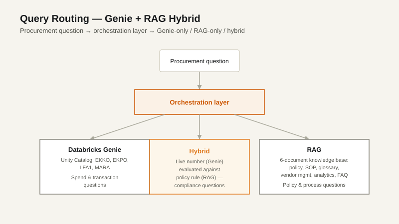

# AI-Powered SAP ERP Intelligence Assistant

**A natural-language procurement assistant for SAP data: Databricks Genie answers the numbers, a RAG layer answers the policy, and an orchestration layer decides which one (or both) a question needs.**


<p align="center">
  
</p>

> **What's in this repo:** the synthetic SAP extracts, the six-document knowledge base, and the PoC architecture and 32-question evaluation plan. The Genie space and the orchestration agents were built and tested inside KaarTech's Databricks workspace during my Data Engineering internship, so that code isn't published here. All company data is **synthetic** (a fictional "Apex Consumer Products").

---

## The problem

SAP holds procurement data behind technical table and field names (`EKKO`, `EBELN`, `LIFNR`) that business users can't query. The rules that decide what that data *means* (approval thresholds, vendor eligibility, escalation paths) live in separate policy documents. A real procurement question usually needs both:

> *"Does PO 4500001234 need Finance approval?"* needs the PO's live value **and** the approval threshold from policy.

A text-to-SQL tool alone gets the number but not the rule. A document chatbot alone knows the rule but not the number.

## How it works

| Route | Answers | Backed by | Example |
|---|---|---|---|
| **Genie** | Spend and transaction questions | SAP tables in Unity Catalog | *Which vendors have the highest spend this year?* |
| **RAG** | Policy and process questions | Six-document knowledge base (Vector Search) | *How do I onboard a new vendor?* |
| **Hybrid** | Compliance judgments | A Genie number evaluated against a RAG rule | *Is this vendor eligible to receive a new PO right now?* |

A synthesis step then rewrites Genie's technical output in business language using the glossary, so users see "Purchase order", not `EBELN`.

## Data

Synthetic extracts of four core SAP MM tables:

| Table | SAP meaning | Rows |
|---|---|---|
| `EKKO` | Purchase order header | 1,000 |
| `EKPO` | Purchase order line items | 3,198 |
| `LFA1` | Vendor master | 100 |
| `MARA` | Material master | 200 |

## Knowledge base

| Doc | Role in the system |
|---|---|
| [01 Procurement Policy](erp_documents/01_Procurement_Policy.md) | The rulebook: approval thresholds, high-value definitions, compliance rules, exceptions |
| [02 Purchase Order Process SOP](erp_documents/02_Purchase_Order_Process_SOP.md) | The process map: lifecycle stages, responsibilities, escalation paths |
| [03 Vendor Management Policy](erp_documents/03_Vendor_Management_Policy.md) | Vendor onboarding, classification and suspension rules |
| [04 SAP Procurement Business Glossary](erp_documents/04_SAP_Procurement_Business_Glossary.md) | **The translation layer** between SAP field names and business language |
| [05 Procurement Analytics Definitions](erp_documents/05_Procurement_Analytics_Definitions.md) | The metrics contract, so aggregations are calculated one documented way, not improvised per query |
| [06 FAQ and Business Scenarios](erp_documents/06_Procurement_FAQ_and_Business_Scenarios.md) | Worked examples of RAG, Genie and hybrid answers; also the source of the evaluation set |

## Evaluation design

A 32-question test set, deliberately balanced so routing mistakes can't hide:

| Route | Questions | What a wrong route looks like |
|---|---|---|
| RAG only | 10 | A policy question answered with a table query |
| Genie only | 10 | A spend question answered from documents |
| Genie + RAG | 12 | A compliance question answered with only the number or only the rule |

The full question list with expected route and source documents is in [`00_PoC_Architecture_Folder_Structure_and_Eval_Plan.md`](erp_documents/00_PoC_Architecture_Folder_Structure_and_Eval_Plan.md).

## Design decisions

- **Hybrid routing is the point, not an edge case.** Twelve of 32 evaluation questions need both paths, because that's where business users actually get stuck.
- **The glossary is the most important document.** Without it the assistant can return correct numbers that nobody outside IT can read.
- **Metrics are defined once, in writing.** Doc 05 stops the model from inventing its own definition of "spend" or "cycle time" for each question.
- **Synthetic data only**, so the design can be shared publicly without exposing anything from a real SAP system.

## Repository contents

```
AI-Powered-SAP-ERP-Intelligence-Assistant/
├── erp_documents/     # 00: architecture + eval plan; 01–06: RAG knowledge base
├── sap_files/         # EKKO, EKPO, LFA1, MARA synthetic extracts (CSV)
└── docs/
    └── query-routing.svg
```

---

Built by [Pavithra Uthrah R K](https://github.com/uthrahh) during a Data Engineering internship at KaarTech · [Portfolio](https://uthrahrk.vercel.app)
